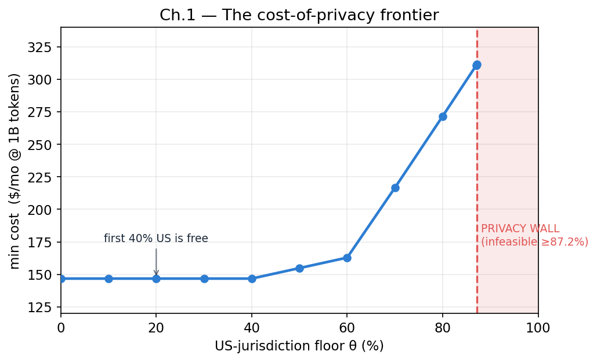
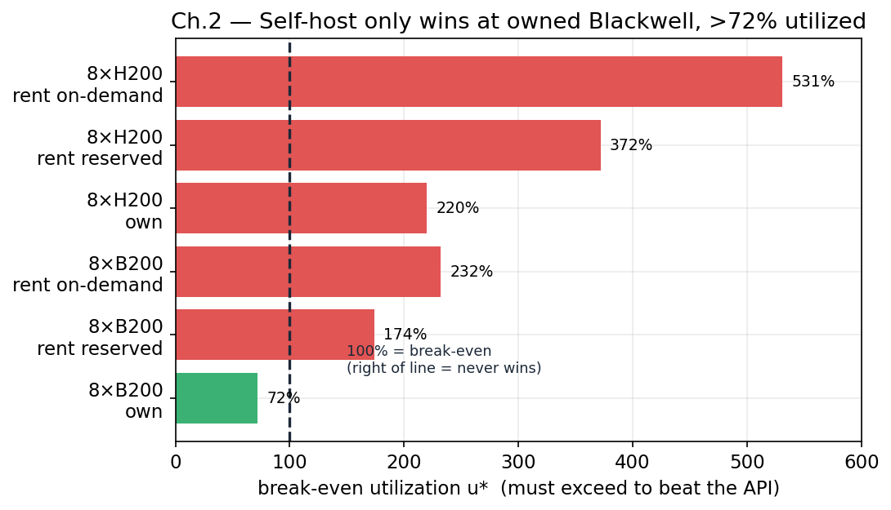
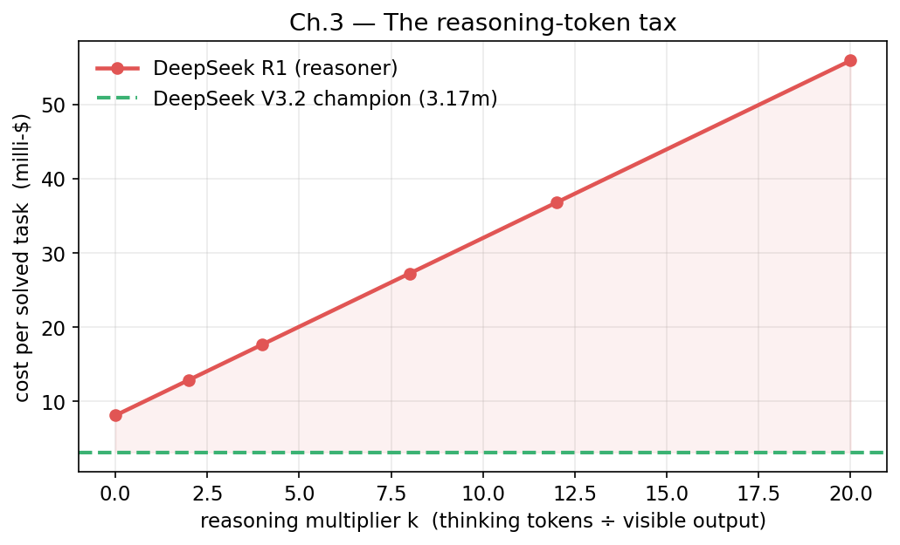
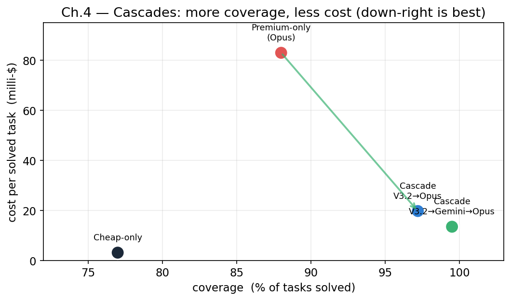
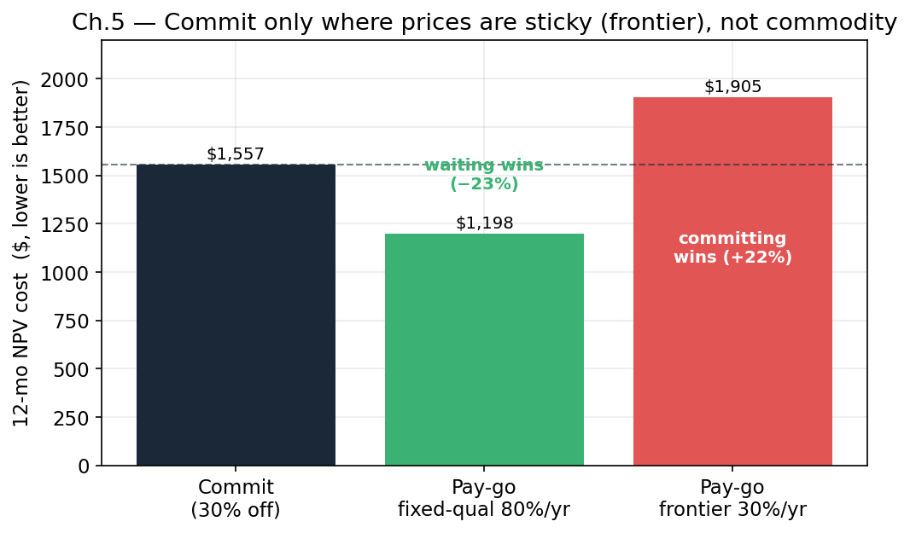
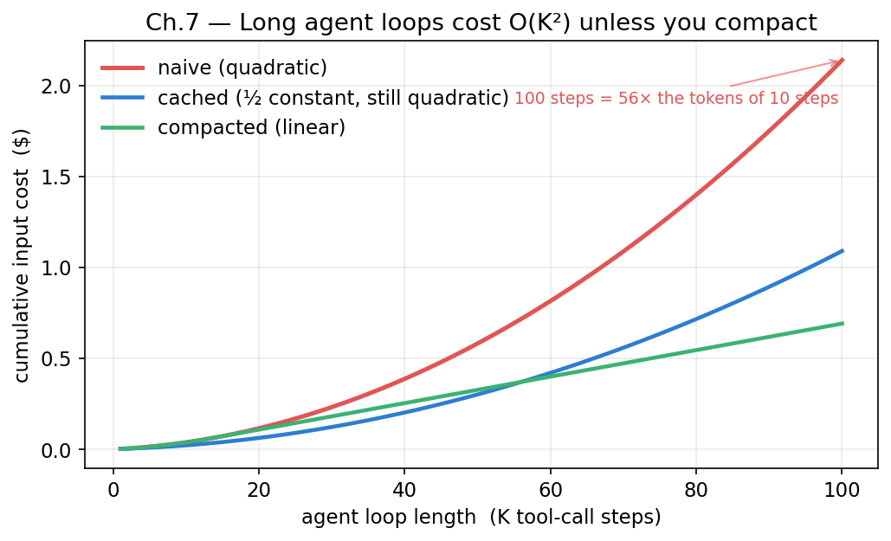

> Every "what's the cheapest model?" thread online is people trading vibes. I got tired of it, so I built a pipeline that pulls *live, cited* prices and runs the numbers through an **exact-rational math kernel** — no floating-point drift, no LLM hallucinating a multiplication. Then I pointed it at eight of the cost questions every agent builder actually faces. Here's everything it found, and the repo so you can re-run all of it.

There are two kinds of LLM cost advice. The first is a benchmark leaderboard with a price column, which tells you nothing about *your* workload. The second is a confident tweet that's quietly wrong because someone multiplied a per-million price by the wrong token count in their head.

I wanted a third kind: a model you can **audit**. Re-run it and you get bit-identical numbers, with the source of every input price one file away. This article is the result — a tour through eight cost decisions, each answered with real money math, and each one teaching something that intuition gets wrong.

Let's start with the question that kicked it off.

---

## Cold open: what's the most cost-effective model to run an agent on?

The setup: I run [Hermes Agent](https://github.com/NousResearch/hermes-agent), a model-agnostic agent framework, and I wanted the cheapest token provider to drive it. Not cheapest *per token* — cheapest **per unit of quality**, because a model that flubs tool calls and retries can cost more than a pricier reliable one.

So the metric is **blended cost ÷ agentic-quality-score**. Blended cost uses a production-agentic token mix (more on that below); quality is a normalized agentic score (mean of BFCL / τ²-bench / SWE-bench Verified). Filters: open-weights, prompt caching, no-train.

| Model @ Provider | Blended $/1M | Quality | $/quality (×1000) |
|---|--:|--:|--:|
| **DeepSeek V3.2 @ OpenRouter** | **0.1145** | 77 | **1.49** |
| DeepSeek V3.2 @ DeepInfra | 0.1951 | 77 | 2.53 |
| MiniMax M2 @ MiniMax | 0.2629 | 73 | 3.60 |
| GLM-4.6 @ z.ai | 0.5276 | 71 | 7.43 |
| Kimi K2 @ DeepInfra | 0.6613 | 66 | 10.02 |
| DeepSeek R1 @ DeepInfra | 0.6519 | 54 | 12.07 |

**DeepSeek V3.2 wins decisively** — it's both the highest-quality open model in the set *and* near the cheapest, because its output token price is absurdly low for its tier. The emerging best deal (pending a quality test) is **DeepSeek V4 Flash on Fireworks** at $0.0896/1M blended — cheapest in the field, with ZDR-by-default and a 50% batch discount.

That's a useful answer. But the *interesting* part is everything that question opens up. If you can split traffic across providers, what's the optimal mix? Should you self-host instead? Is the "smart expensive model" actually cheaper once you count its thinking tokens? Each of those is a chapter.

First, how this is built.

---

## The toolchain: research agents + an exact-math kernel

The pipeline has two halves, and the whole point is that **the LLM never touches the arithmetic.**

**1. Research agents gather live, cited inputs.** Token prices in 2026 move monthly — half the models in my training data are already legacy. So every price and benchmark in this guide came from a research agent doing live web search/fetch, returning a structured table with source URLs and observation dates. Those land in `data/` (`pricing.md`, `quality.md`, `gpu.md`, `frontier.md`, `decline.md`), each one auditable.

**2. An exact-rational kernel does the math.** I used [`agent-calc`](https://github.com/copyleftdev/agent-calc), an AI-native computation kernel that works in exact rationals — `3/5 × 1,000,000` returns `600000`, not `599999.9999998`. It exposes typed domains: `rational`, `linear` (LP), `finance` (NPV/amortization), `solve` (algebra), `stats` (distributions), `polynomial`, `interval` (uncertainty arithmetic). Every chapter below drives a different one.

Why bother? Because cost models are exactly where floating-point lies and LLMs fumble: tiny per-token prices, huge token counts, compounding rates. When an answer is "self-hosting breaks even at 87.2% utilization," you want that to be *computed*, not vibed. And the secret structure of this guide is that each chapter answers a money question **and** exercises one kernel domain — it's a cost-modeling handbook that doubles as a tour of exact computation.

### The shared workload model

Every chapter uses one production-agentic token profile, because agent tool-loops are wildly input-heavy:

| Component | Share of tokens |
|---|--:|
| Fresh input | 21.25% |
| Cached input | 63.75% |
| Output | 15% |

That's an 85/15 input/output split with 75% of input being a cache hit (the system prompt, tools, and skills get re-sent every tool-loop step). Blended price = `0.2125·in + 0.6375·cached + 0.15·out`. Chapter 7 explains *why* this profile is forced on you; Chapter 6 explains why the cache hit rate is so high. For now, take it as the workload.

---

## Chapter 1 — Optimal multi-provider routing (a linear program)



You don't have to pick one provider. Run a cheap one for the bulk, escalate elsewhere when constraints demand. The optimal split — minimize spend subject to a quality floor, per-endpoint capacity caps, and a **US-jurisdiction floor θ** — is a literal linear program. `agent-calc` solves it (`solve_lp`), then I re-verify the winning allocation's cost in exact rationals (the LP solver is f64; the headline number shouldn't be).

Sweeping the privacy knob θ traces a **cost-of-privacy frontier**:

| US floor θ | min $/1M | $/mo @ 1B | allocation |
|--:|--:|--:|---|
| 0.00–0.40 | 0.1468 | $146.77 | A=0.60, B=0.40 |
| 0.60 | 0.1629 | $162.89 | A=0.40, B=0.60 |
| 0.80 | 0.2716 | $271.61 | A=0.20, B=0.60, F=0.13, H=0.07 |
| **0.872** | 0.3116 | $311.59 | A=0.13, B=0.60, F=0.27 |
| ≥ 0.873 | — | **INFEASIBLE** | the privacy wall |

Three things intuition misses:

1. **The first 40% of US-jurisdiction traffic is free** — the cost-optimal blend already lands there, because the cheapest provider is capped at 60% and the overflow falls on a US endpoint anyway.
2. **The marginal cost of privacy is convex** — 40→60% is cheap; past 60% the quality floor forces in weaker fillers and the bill nearly doubles by 87%.
3. **There's a hard wall at 87.2%.** Only *one* high-quality US endpoint exists in this menu; beyond its capacity the math is infeasible. To break the wall you need a second high-quality US provider, or you accept single-point-of-failure risk.

---

## Chapter 2 — Self-host vs. serverless: it's a utilization question



Everyone's instinct: "at some volume, renting GPUs beats per-token APIs." The reframe that changes everything: **a self-hosted node costs the same at 5% load or 95% load**, while the API scales linearly with tokens. So it's not a *dollar* break-even — it's a **break-even utilization**: how busy must the box stay to win?

```
u* = node_$/mo × 1e6 / (capacity_tokens/mo × API_$/1M)
```

If `u* > 100%`, self-hosting loses *even at full tilt*. Modeling DeepSeek V3.2 (8-GPU node) against DeepInfra's $0.195/1M, with `agent-calc` handling the owned-hardware amortization (`finance`) and the exact `u*` (`eval`):

| Hardware / procurement | break-even u* | verdict |
|---|--:|:--|
| 8×H200, rent on-demand | 531% | never |
| 8×H200, own (amortized) | 220% | never |
| 8×B200, rent reserved | 174% | never |
| **8×B200, own (amortized)** | **72%** | **the only winner** |

For a commodity model this cheap on the API, **renting GPUs loses in every configuration** — the serverless provider batches across thousands of tenants to hit a utilization you can't. The *only* config that wins is **owned Blackwell silicon kept above ~72% utilization 24/7** (~56B tokens/month of steady load). And against the falling API floor ($0.0896/1M), even that roughly doubles its break-even. The takeaway: **self-host for privacy, control, or latency — not to cut the token bill.**

---

## Chapter 3 — The reasoning-token tax



Reasoning models emit hidden "thinking" tokens, billed at the output rate. A 600-token answer can bill 7,800. Does the higher success rate justify the burn? The honest unit isn't $/token — it's **cost per *solved* task** = attempt cost ÷ success rate.

With `agent-calc` computing exact costs (`eval`) and the break-even success rate (`solve`):

| Model | k (think mult.) | $/solved | ×champion |
|---|--:|--:|--:|
| **DeepSeek V3.2** | 4 | **3.17m** | **1.00×** |
| MiniMax M2 | 2 | 4.03m | 1.27× |
| Kimi K2 | 1 | 8.79m | 2.77× |
| GLM-4.6 | 5 | 13.77m | 4.35× |
| DeepSeek R1 | 12 | 36.80m | 11.61× |

(`m` = milli-dollars = $0.001/task.)

The killer result: **DeepSeek R1 would need a 627% success rate** to match V3.2's cost-per-solved — mathematically impossible. Even a *perfect* R1 stays far more expensive, because its per-attempt token burn alone exceeds V3.2's entire cost-per-solved. The sweep confirms it: even at k=0 (zero thinking), R1 is still 2.6× the champion.

The rule: **the reasoning tax only pays when output tokens are cheap.** Thinking is a multiplier on the output price. Pay $2.15/M and ×12 and you've built the most expensive possible way to solve a task; pay $0.38/M and the same multiplier barely registers.

---

## Chapter 4 — The retry cascade



You don't need one model for every task. Run a **cheap** model on everything, **escalate** to a reliable premium model only on the residual failures. `agent-calc` computes the escalation probability (`stats/binomial_pmf`) and the exact expected cost (`eval`).

| Strategy | cost/solved | coverage | % → premium |
|---|--:|--:|--:|
| Cheap-only (DeepSeek V3.2) | 3.17m | 77.0% | 0% |
| Premium-only (Claude Opus 4.8) | 82.96m | 88.0% | 100% |
| **Cascade V3.2 → Opus** | **19.78m** | **97.2%** | 23% |
| **Cascade V3.2 → Gemini → Opus** | **13.52m** | **99.5%** | 4.4% |

The cascade beats premium-only on **both** axes: higher coverage (97% vs 88%) at a quarter the cost, because only 23% of tasks reach the expensive model. Adding a mid-tier pushes coverage to 99.5% while *cutting* cost further — the cheap+mid tiers absorb 95.6% of traffic, so the $73m Opus call fires on 4.4% of tasks.

And the trap to avoid: **retrying the *same* model never changes cost-per-solved** (it stays C/p), and for deterministic failures it doesn't even raise coverage. Only escalating to a *different, stronger* model moves the needle. "Just add retries" is a no-op; "add a tier" is the win. (The cost advantage survives even strong failure correlation — 3.6× cheaper than premium-only even when the premium rarely rescues what the cheap model botched.)

---

## Chapter 5 — The NPV of waiting



A provider offers a discounted *reserved* rate if you commit for a year. Locking it in feels prudent — but token prices fall fast, and you might be locking yourself *above* where pay-go will be in six months. This is a present-value problem: NPV the committed cash-flow stream against the declining pay-go stream (`agent-calc finance/net_present_value`), and find the **break-even decline rate**.

The decisive input is that price decline depends entirely on what you hold fixed:
- **Fixed-quality** (same capability getting cheaper): **~80%/yr** (a16z/Epoch).
- **Frontier** (always run the best): **~30%/yr**, sometimes flat or rising.

At a 30%-off, 12-month commit:

| Workload | central decline | winner |
|---|--:|:--|
| **Fixed-quality** | 80%/yr | **pay-go (−23%)** |
| **Frontier** | 30%/yr | **commit (+22%)** |

And the break-even decline grid shows committing **never** wins for commodity models (80%/yr exceeds every reservable discount's break-even), while longer terms always make it worse: a 30% discount breaks even at 57.8%/yr over 12 months but only **24.5%/yr over 36 months**. The rule: **reserve where prices are sticky (frontier); ride the curve where they fall fast (commodity). Never sign a 3-year inference commit in a market falling >25%/yr.**

---

## Chapter 6 — Prompt-cache ROI

Caching looks free, but a cache *write* often costs more than a normal input token (Anthropic charges up to 2×), while reads are cheap. So it's a bet: pay the write premium to save on reads, and it only pays if you reuse enough before the cache expires. The break-even reuse count is `N* = (write − read)/(in − read)`.

| Provider | break-even N* | savings ceiling |
|---|--:|--:|
| DeepInfra / DeepSeek / OpenAI / Fireworks (no write fee) | 1.00 | 50–90% |
| Anthropic Opus 5-min TTL (1.25× write) | 1.28 | 90% |
| Anthropic Opus 1-hr TTL (2× write) | 2.11 | 90% |

**Caching pays almost immediately** — most providers from the second call, even the harshest write premium by the third. The *read* multiplier sets the long-run ceiling (0.1×-read → 90% savings; 0.5×-read → 50%), so for cache-heavy loops that's the number that compounds. Using `agent-calc`'s `interval` domain, an 8k-token agent prefix reused an uncertain 3–20 times costs $0.088–0.156 cached vs $0.12–0.80 uncached — **80% off at the high end**, even with a 2× write premium. This is why the guide's 75% cache-hit assumption holds: agent loops reuse a large prefix 10–20× per task.

---

## Chapter 7 — Agent-loop compounding (the O(K²) tax)



Why is that reused prefix so large? Because a multi-turn agent re-sends its growing context every step — at step *k*, the input is the base prompt plus *every prior tool call and result*. Per-step input grows linearly, so **cumulative input over a K-step task grows quadratically**:

```
cumulative over K = (δ/2)·K² + (B − δ/2)·K
```

`agent-calc` evaluates that polynomial exactly (`polynomial/evaluate`):

| K steps | cum tokens | naive $ | cached $ | compacted $ |
|--:|--:|--:|--:|--:|
| 10 | 147,500 | 0.0384 | 0.0220 | 0.0384 |
| 50 | 2,237,500 | 0.5817 | 0.3015 | 0.3267 |
| 100 | 8,225,000 | 2.1385 | 1.0896 | 0.6907 |

A 100-step task isn't 10× a 10-step task — it's **56×**. Your 50th tool call's input costs 10× your first. **Caching bends the curve (lowers the constant); only compaction breaks it** — capping the context window turns the quadratic linear, and the gap widens without bound as loops get longer. They compose: cached *and* compacted is read-rate pricing on a linear token count. For any loop past ~20 steps, do both.

This closes the loop on the whole guide: the quadratic re-send is exactly why agent workloads are so input-heavy and so cache-dependent — the entire shared workload profile falls out of this one chapter.

---

## The cheat sheet

Everything above, compressed to decisions:

| Decision | Verdict |
|---|---|
| **Which model?** | Cheap efficient hybrid (DeepSeek V3.2-class). Cheap output + high success beats everything on cost-per-solved. |
| **One provider or many?** | Blend via LP. First ~40% of any jurisdiction/diversity constraint is usually free. |
| **Self-host?** | No — for cost. Renting always loses for commodity models; only owned next-gen hardware at >72% utilization wins. Self-host for privacy/control. |
| **Reasoning model?** | Only if its output tokens are cheap. A pricey heavy reasoner can be mathematically uncatchable on cost-per-solved. |
| **Retries?** | Cascade to a *different*, stronger model — never retry the same one. 3 tiers ≈ 99.5% coverage at ~6× lower cost than going straight to frontier. |
| **Commit to reserved capacity?** | Only for sticky frontier prices, short terms. Never for commodity models in a market falling 50–90%/yr. |
| **Caching?** | Always, for any reused prefix. Pays from call 2–3. Prefer 0.1×-read providers. |
| **Long agent loops?** | Cap the context window (compaction) past ~20 steps, or pay quadratically. |

## Reproduce it

The whole thing is [a repo](https://github.com/copyleftdev/rational). Each chapter is a self-contained script that shells out to [`agent-calc`](https://github.com/copyleftdev/agent-calc); each input price lives in `data/` with a source URL and observation date.

```bash
git clone https://github.com/copyleftdev/rational
make all       # re-run every chapter
make ch04      # or just one
```

Same inputs → bit-identical outputs, every time. The LLM did the modeling and pulled the data. The math kernel did the math. That division of labor is the only reason I trust any number in this article — and it's the part I'd encourage you to steal.
